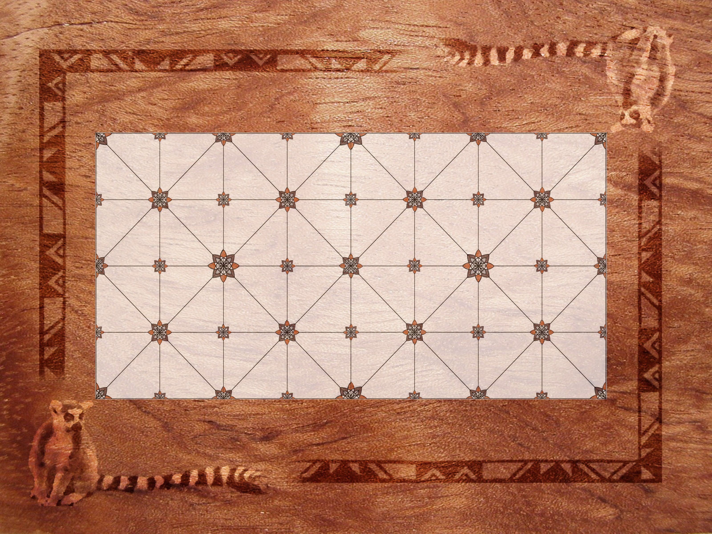
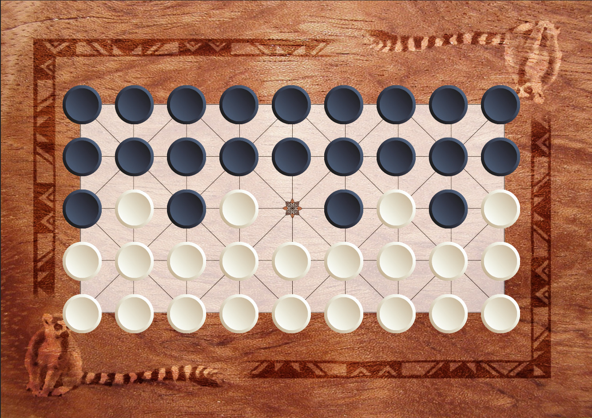

# Fanorona

Fanorona / Vela - traditional abstract Malagasy strategy board game for two players

# Fanorona Rules

<b>Fanorona</b> is a board game.

## Game Components

<table>
  <tr>
    <td width='84%'>

    </td>
    <td width='8%'>

    </td>
    <td width='8%'>

    </td>
  </tr>
</table>

The rectangular Fanorona board has fixed dimension of 9 column times 5 row positions.
Positions on board are connected by a fixed line pattern showing potential
paths of movement for players’ checkers. The checkers are placed on the positions (or
points) of line intersections in the line pattern. There are two opposing players:
one is controlling the light checkers and the other is controlling
the dark checkers.

## Objective

Winning condition is to leave the opponent with no remaining legal moves left according to the rules.
Game might end in a draw on mutual agreement of both players.

## Initial Starting Position

<table>
  <tr>
    <td>
      
    </td>
  </tr>
  <tr>
    <td>
      Initial board setup of Fanorona
    </td>
  </tr>
</table>

Each player initially controls the 22 checkers of own color.

## Turn Sequence, Moving and Capturing

The player controlling the light checkers moves first. Game play
alternates between both players. Passing a turn is not allowed.
In case a series of consecutive captures are performed by the
same checker on a player's turn this will be denoted as a
single capturing move.

Capturing is mandatory if possible. In case multiple captures exist
the active player can freely choose which to perform. On each
capture all captured opponent's checkers are removed immediately.

There are two types of captures, either by approaching or withdrawal.
If a capturing checker is moved towards an adjacent free field with an opponent's
checker in straight line of movement then it will capture the opponent's checker
and all opponent's checkers following in line until a free space, own checker
or board edge breaks this line. Here it is capturing the checker or group
of checkers by approaching these. Alternatively a capturing checker can be
moved in opposite direction onto a free field and captures opponent's single
or multiple checkers by withdrawal moving away from these in straight line.

If a capturing checker is allowed to continue capturing by additional
movement of this same checker then the player may decide to continue
capturing in this same move. On such consecutive captures the player is
allowed to stop capturing after each movement.

If the current capturing movement results in both opportunities to capture
some of the opponent's checkers by approach and some other group in
opposite direction by withdrawal then the player has to decide to capture
by either approach or withdrawal. The other group of opponent's checkers
is not captured then.

A consecutive capture is allowed only if the following capture movement is
performed by change of direction. Additionally on a consecutive capture the
capturing checker may not be moved onto any field it previously reached in this
sequence or turn.

A non capturing move is called a <b>Paika</b>. Paika is allowed only if
no captures can be performed. Then a checker is moved onto an adjacent
free field following the line pattern.

# Vela Rules

After playing Fanorona traditionally a set of Vela rounds is played.
This repeats until the player losing the Fanorona round will win a
Vela game. Then players switch back to regular Fanorona rules again.

In Vela the initial setting is exactly the same as in Fanorona.
The player losing the previous game (Fanorona or Vela) starts first.
Turn alternates between players.

Now the Vela is played in two phases. During the first phase only the
loser of the previous game is capturing just a single checker on his
turns. While the winner of the previous game is only moving a single
checker on his turn. This repeats until 17 checkers are captured.
Consecutive capturing in a sequence of captures is not done in
this phase of the Vela. Even if a row of the previous winner's
checkers exists then on either withdrawal or approach only the first
adjacent checker is captured.

As soon as the previous winner has 5 checkers left on board the
second Vela game phase starts. Now the Vela game continues with
exactly same rules known from the regular Fanorona.

The Vela game ends

* with either the player losing all of his checkers losing the Vela, or
* with the loser from the previous game not being able to capture a single checker during the first phase, or
* on mutal agreement as a draw.

# 3rd Party Libraries

* jQuery: MIT licensed, https://github.com/jquery/jquery
* jQuery Mobile: MIT licensed, https://github.com/jquery/jquery-mobile
* Raphaël: MIT licensed, https://github.com/DmitryBaranovskiy/raphael

# Credits / Contributors / Authors

* Oliver Merkel

_All logos, brands, and trademarks mentioned belong to their respective owners._
