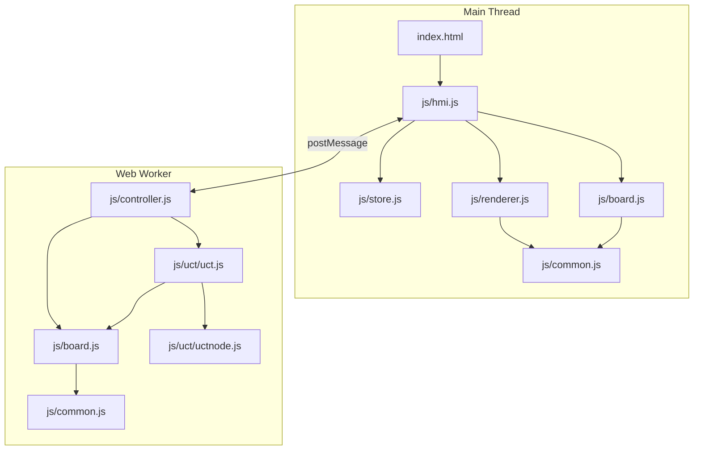
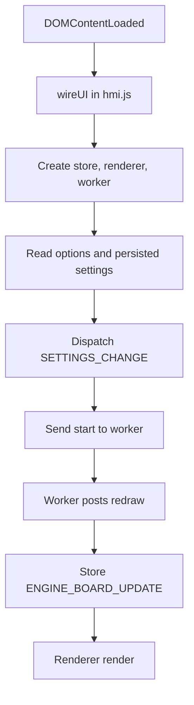
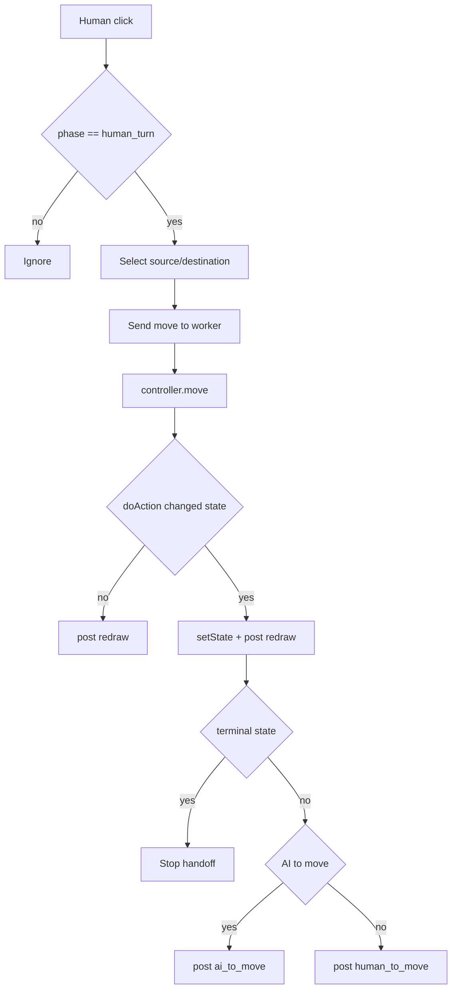

# Software Architecture - Fanorona and Vela

> Copyright (c) 2016, 2026 Oliver Merkel. MIT License.

## 1. Overview

This is a browser-only single-page application implemented with vanilla ES modules.
The design keeps UI and rendering on the main thread while game-state transitions and AI
search run in a dedicated Web Worker.

- Main thread: DOM, SVG board rendering, options/navigation UI
- Worker thread: authoritative game state, legal-move validation, UCT/MCTS decisions
- Pure game logic module (`js/board.js`) shared by worker and tests

## 2. Dependency Diagram



## 3. Runtime Flows

### 3.1 Startup



### 3.2 Move and Turn Handoff



## 4. Core Data Model

```ts
type Player = 0 | 1;
type Piece = 0 | 1 | 2;

interface CellRef {
  row: number;
  column: number;
}

interface Action {
  from: CellRef;
  to: CellRef;
  type: 'capture' | 'move';
  captureMode?: 'approach' | 'withdrawal';
  captures?: CellRef[];
}

interface VelaState {
  phase: 1 | 2;
  previousWinner: Player;
  phaseOneCapturer: Player;
  phaseOneCaptured: number;
}

interface BoardState {
  active: Player;
  grid: Piece[][]; // 5x9
  winner: Player | null;
  isDraw: boolean;
  latestMove: Action | null;
  winningLine: CellRef[] | null;
  variant: 'Fanorona' | 'Vela';
  turnContext: {
    capturingPiece: CellRef;
    visited: string[];
    previousDir: { dr: number; dc: number } | null;
  } | null;
  vela: VelaState | null;
}
```

## 5. Worker Messaging

```ts
interface WorkerSettingsPayload {
  gamevariant: 'Fanorona' | 'Vela';
  playersouth: 'Human' | 'AI';
  playernorth: 'Human' | 'AI';
  difficultysouth: 'Easy' | 'Medium' | 'Hard';
  difficultynorth: 'Easy' | 'Medium' | 'Hard';
  deviceprofile: 'Auto' | 'Desktop' | 'Mobile';
  selectionmode: 'MustMove' | 'Flexible';
  resolveddeviceprofile: 'Desktop' | 'Mobile';
}

interface WorkerRequestMessage {
  class: 'request';
  request: 'start' | 'restart' | 'move' | 'action_by_ai' | 'sync';
  settings: WorkerSettingsPayload;
  action?: Action;
}

interface WorkerEventMessage {
  eventClass: 'request';
  request: 'redraw' | 'human_to_move' | 'ai_to_move';
  board: BoardState;
}
```

## 6. Module Responsibilities

### js/common.js

- Board constants (`ROWS = 5`, `COLUMNS = 9`, piece IDs)
- Variant constants (`Fanorona`, `Vela`)
- Stable action signature helper `actionToKey(action)`

### js/board.js

- Pure rules, legal move generation, and state transitions
- Fanorona capture logic: approach and withdrawal
- Mandatory capture and capture-sequence constraints
- Vela phase handling and phase transition
- `Board` adapter for UCT simulation

### js/controller.js

- Worker orchestrator and single writer of board state
- AI budget selection by side, difficulty, device profile, and phase
- Request handling: `start`, `restart`, `move`, `action_by_ai`, `sync`

### js/hmi.js

- Composition root (store + renderer + worker)
- Menu navigation, options persistence, and variant selection
- Worker event mapping to reducer actions

### js/renderer.js

- Dynamic SVG line-board rendering for Fanorona geometry
- Piece rendering and move overlays
- Visual turn/status line and interaction rings

### js/store.js

- Minimal Redux-like store
- Pure reducer for view, phase, board snapshot, and settings

## 7. Ambiguous Capture Selection

When a move allows both approach and withdrawal captures from the same cell, the UI highlights all possible capture targets directly on the board. The player selects the group to capture by clicking the highlighted piece or group. The legend at the top of the board indicates which color corresponds to approach or withdrawal. This avoids modal dialogs and keeps interaction board-native.

## 8. Visited Cell Highlighting

During consecutive captures, all previously visited cells by the capturing piece are visually marked. This helps the player track which cells are no longer eligible for revisiting, enforcing the rule that a piece cannot revisit the same cell in a capture sequence. The highlight is a subtle color ring and/or stroke on the visited pieces.

## 9. How to Tune AI

The AI uses UCT/MCTS with device- and difficulty-aware budgets. To tune AI strength and responsiveness:

- Adjust `maxIterations` for more/fewer search loops (higher = stronger, slower).
- Adjust `maxTime` (ms) for wall-clock time per move (main control for responsiveness).
- Adjust `maxDepthSimulation` for how deep each rollout explores (higher = more tactical, slower).
- Adjust `maxLookAhead` for total path length per iteration (safety guard for runaway depth).

See [doc/engine_mcts_ucb.md](engine_mcts_ucb.md) for parameter details and device profiles. For most users, the UI options for device profile and difficulty are sufficient. Advanced users can edit the budget tables in `js/controller.js`.

## 10. Testing

- Unit tests (`tests/unit/*.test.js`) validate game rules, worker behavior, store, and UCT internals.
- E2E tests (`tests/e2e/game.spec.js`) validate navigation, options, variant switching, board interaction, and accessibility checks.
- Coverage thresholds are enforced in `vitest.config.js`.
